  

# Arrival

Welcome in China. You made it to the destination airport. Unless your are one of the
very few foreigners who can speak and read Chinese, potentially the most challenging
part of your journey is about to begin.
Below we will introduce:

- [the precautions in china](#precaution)

- [from Shanghai Hongqiao Airport, how to get to the conference center in Suzhou](#Hongqiao)

- [from Shanghai Pudong International Airport, how to get to the conference center](#Pudong)

If you arrive
from somewhere else and need help, please let us know. If you need help while travelling,
the local organiser can be reached on the mobile:

 Zhaohui:  (+86) 13646206084

 

## Precautions
China is generally a safe country for travelling, if the usual precautions are taken. We
assume you have never been in China before, therefore let us still start with some general
points.

* **Weather**
End of November is the time when it will be comfortable in Suzhou (usually lay in 10-20℃).
It is warm in the day time and may be a little cold at night. So do not forget a jumper or sweater.
It may also rain. 

* **Bottled Water**
Whereas in many places it is safe to drink water from taps, do not
take chances and drink only bottled water! During the conference we will provide
bottled water. In other places you have to buy bottles yourself. Remember, Chinese
are famous for nibbling on a bottle of hot tea the whole day, even in sweltering
temperatures. There is a reason for this.

* **Traffic**
Do not even think of renting a car in China. Hence, while in China, you
probably will be mostly going around on foot. Be careful though: You might come
from a region where traffic rules are organised so that pedestrians are mostly treated
with respect by all other road users, or even have an "elevated status" because they
are considered the "weakest". Traffic in China is, in contrast, organised more, shall
we say, according to a Darwinian model: Under no circumstance assume a car (or
even a bicycle or one of the many noiseless electric motor bikes) will stop for you. As
pedestrian, you have to take care of everybody else.
 
Therefore, whenever possible
cross roads at traffic lights and even if the light shows green for you, look out for
cars that pay no attention to this fact. Also, zebra crossings do not, I repeat, do not
have any special meaning in China for the road users higher up the traffic ladder
(i.e. bicycles and above). Even if it sounds too funny, take our word and heed this
advice...it might increase your life-expectancy.

* **Free Public Wifi/Mobile Phones**
While free public wifi is nowadays pretty ubiquitous
in big cities in China (Starbucks, Costas, McDonalds are obvious places where
to find wifi), you need nearly always a working mobile phone in order to use it. You
will have to register your number when you log in, and the wifi operator will then
send you a password token via SMS. The problem is that chances are great your
mobile phone will not work in China. Therefore do not assume you can check information on the Internet while travelling.
 
At the hotel and the conference center there will be wifi. But again, do not assume you can download that last episode of the Daily Show: while bandwidth will generally be enough for reading email, be prepared for an uninterrupted stay in China, free from any disturbance coming from online demands. 

* **Google etc**
There are two Great Walls in China: one prevents you from accessing
Google, for example. Use <https://www.aol.com> or <http://www.bing.com> instead as your preferred
search engine. Also, if you care about such things, set your status on Facebook to
"unavailable" for the period of time you will be in China. Ditto Twitter. Skype and
Facetime, in contrast, work fine. Dropbox, no.

* **Map of Hotel/Taxis**
While more and more young Chinese are exposed to English,
you cannot rely on anyone of the general public speaking more than a few words.
Rather, you have to always calculate with the very, very likely scenario that nobody
speaks any English at all and all signs around you are written in characters that do
not give you the slightest idea what they are about. This means you always have to
prepare your travelling beforehand and ask us for help if you are unsure!
 
One part of every trip preparation, including your arrival, should be to carry with you
a printed copy of the map where the conference center is located ([the map of the conference center](photo/map1.pdf)). When
you want to go to the conference center by taxi, you need to show the map to the driver, since
telling the name of the conference center will most probably not be understood and also the driver most
likely does not know where it is located. Showing the map will also guard against
the possible situation where a taxi driver cannot actually read the address. Take the
map always with you: it might be your life-line for avoiding unpleasant situations.
For travelling inside Suzhou, taxis can be hailed at the street curb. You need to pay
them in cash. They are always metered.

* **Tips in Restaurants, Taxi**
One easy aspect of travelling in China are matters to do
with tipping: no tips are expected when paying at a restaurant, for a taxi journey
etc. The good thing about this is you are treated as a nice customer, if you are a nice
customer (meaning you treat staff with respect).

* **Cash/Credit Cards**
While foreign credit cards are accepted in a number of places,
including the hotel, these places are considered "upmarket" in China. So if you
insist on being able to use your credit card, you will often be paying some form of
premium. Cash still rules many aspects of Chinese life (metro ticket, taxi journey,...)
where foreign credit cards are of no use (China has its own credit card system which
is accepted more widely, but also not everywhere). Pretty much the only places
where cash can be obtained with a foreign credit card are ATMs in Chinese banks.
There are several not far from the conference center.

 

## Travel from Shanghai Hongqiao Airport to the Conference Center
In short, you have to get to (1) Hongqiao railway station and then from there to (2) Suzhou railway station. From Suzhou railway station it is best to take a taxi. Overall this will take approximately 2h of travelling to the conference center. 

### From Hongqiao Airport to Hongqiao Railway Station
* **From Terminal 2:** If you will land on Terminal 2, there are essentially two travel options to Hongqiao railway station: one by walk; the other by metro. Hongqiao railway station is nearly 1km to Terminal 2. If you prefer to walk there, you should first get to B1 floor of Terminal 2. Then following the Train signs, you will arrive at the railway station. The path to the railway station is carefully designed and friendly for foreigners.
 
If you want not to walk, you can take Metro Line 2 from the airport to the railway station. Reaching B1 floor of Terminal 2, then you will find the Subway Line 2 sign.
 
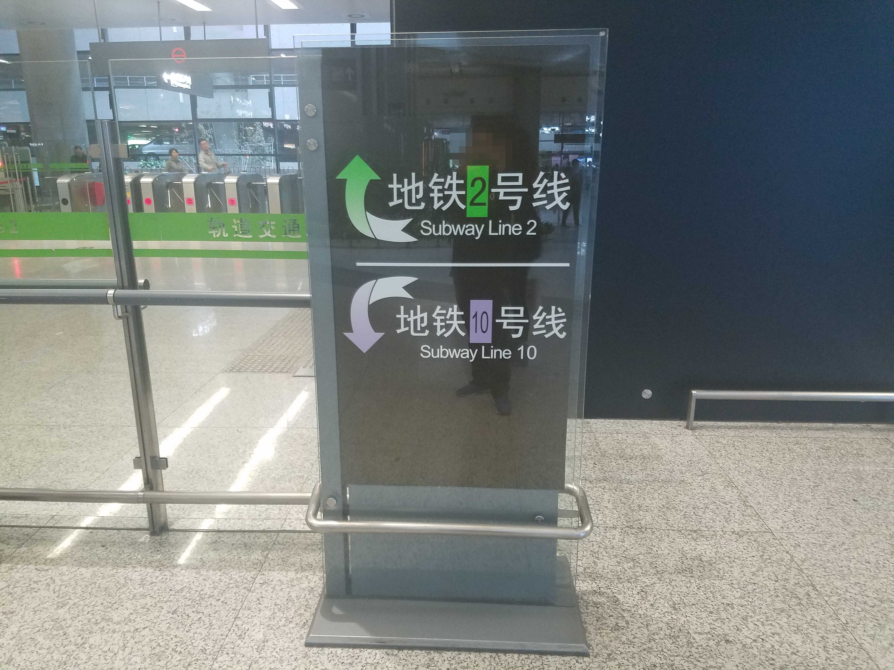
 
  The green arch arrow on the sign means you should walk clockwise along the guard bar to enter the metro.
  You should buy a ticket for Hongqiao Railway Station, which costs 3 RMB. At Hongqiao Railway Station, following the signs for "Train", you will exit the metro station. Metro Line 2 runs from 6:05 to 23:47 from Sunday to Thursday, and from 6:05 to 00:57(the next day) from Friday to Saturday. 

* **From Terminal 1:** If you will land on Terminal 1, Metro Line 10 is very convenient. Following signs for "Subway", you will find the metro entrance.
  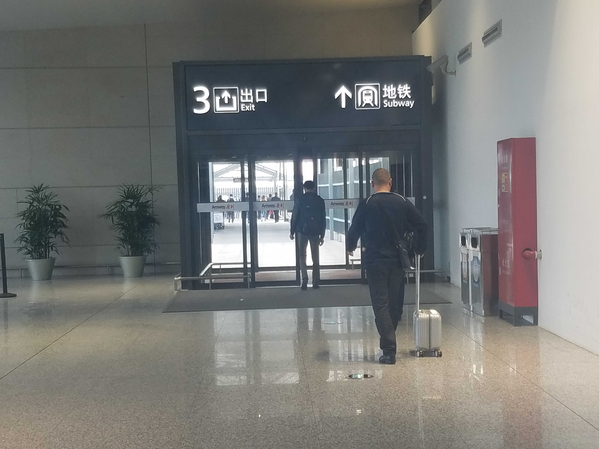  
  Then you should buy a ticket for Hongqiao Railway Station, which costs 3 RMB. Metro Line 10 runs from 6:18 to 23:22 from Sunday to Thursday, and from 6:18 to 00:42(the next day) from Friday to Saturday. 

 

### Getting a Ticket for the Metro in Shanghai
Like most Chinese metro stations, entering the metro station at the airport means you have to go through a brief security check where your luggage will be X-rayed. After the check you will see ticket machines

   
  <table><tr>
  <!-- <td>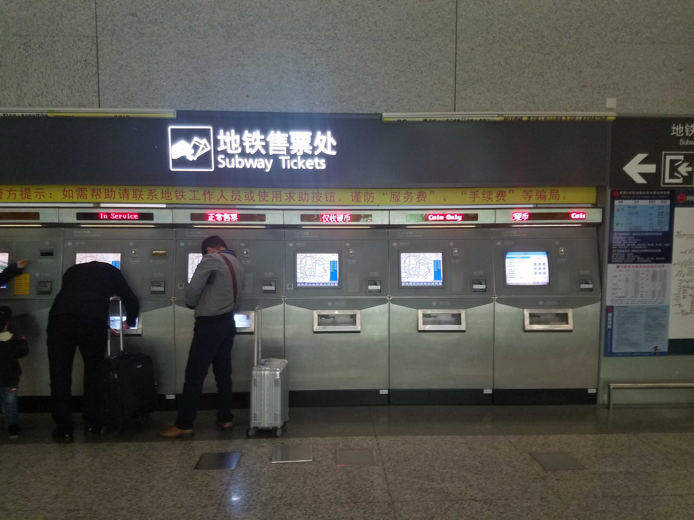</td> -->
  <td>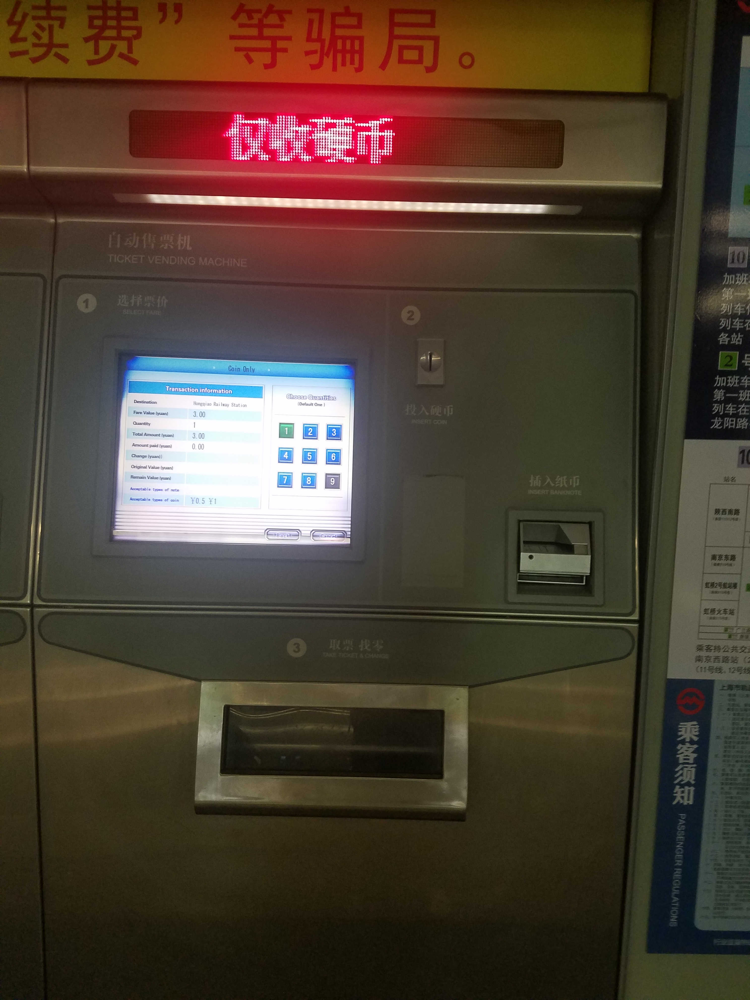</td>
  <td>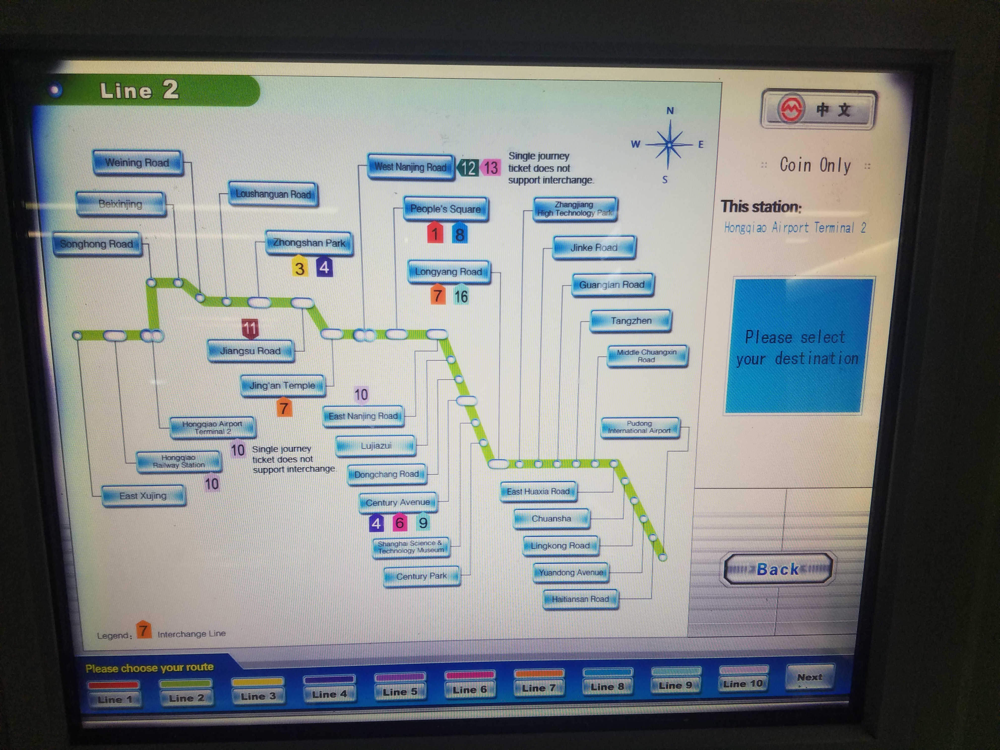</td>
  </tr></table>
   
  
  which can change language to English (in this way you can avoid having to talk to a sales person in the ticket counter, who might not speak any English). You need to select the metro line number and the destination station on the touch screen (shown on the right). Next you need to pay for the ticket with 10 RMB or 5 RMB bank notes, or 1 RMB coins. If you do not have them yet, you will need to get your ticket from the counter. After paying, the machine will issue a card which is your ticket. This card needs to be swiped when going through the gates of the metro (shown as below). At the end of your journey you will have to return the card at the exit gate.
  
    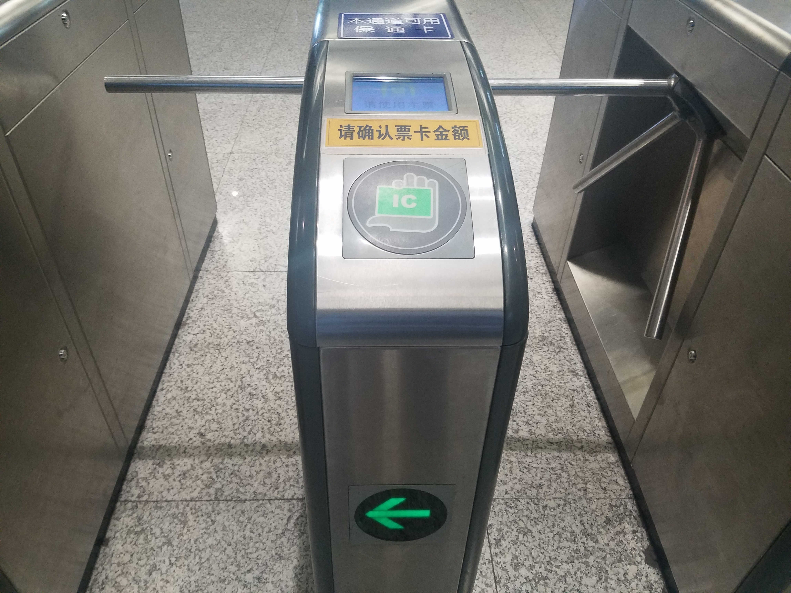  
  
  You can learn more from [this video](https://www.youtube.com/watch?v=-ISy1ednyoc) in youtube. 

 

### From Hongqiao Railway Station to Suzhou Railway Station via High-Speed Train 
As background, train stations above the village level in China are organised more
like an airport, than the more sleepy train station you might be familiar with. Therefore,
you first have to go through a security gate where luggage is checked and you padded by
a security guard. The security guard is female and this is seen as normal by
Chinese.

Next you need to buy a train ticket. If you exit from metro station, following signs for "Railway Ticket Office (2F)", then you will find ticket counters as left below.

   
  <table><tr>
  <td>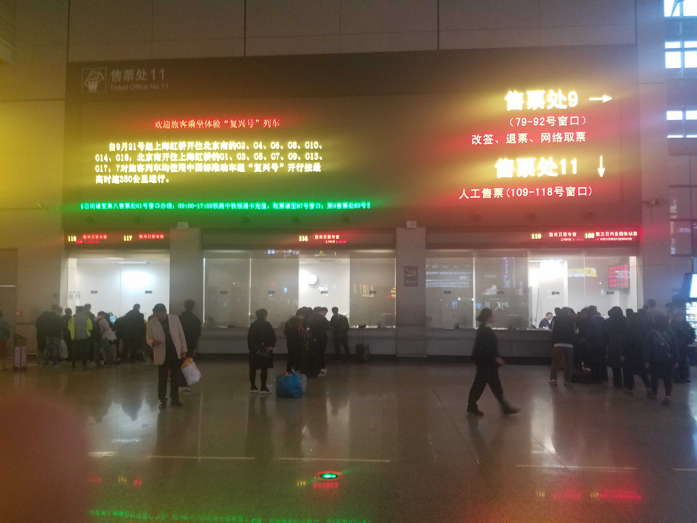</td>
  <td>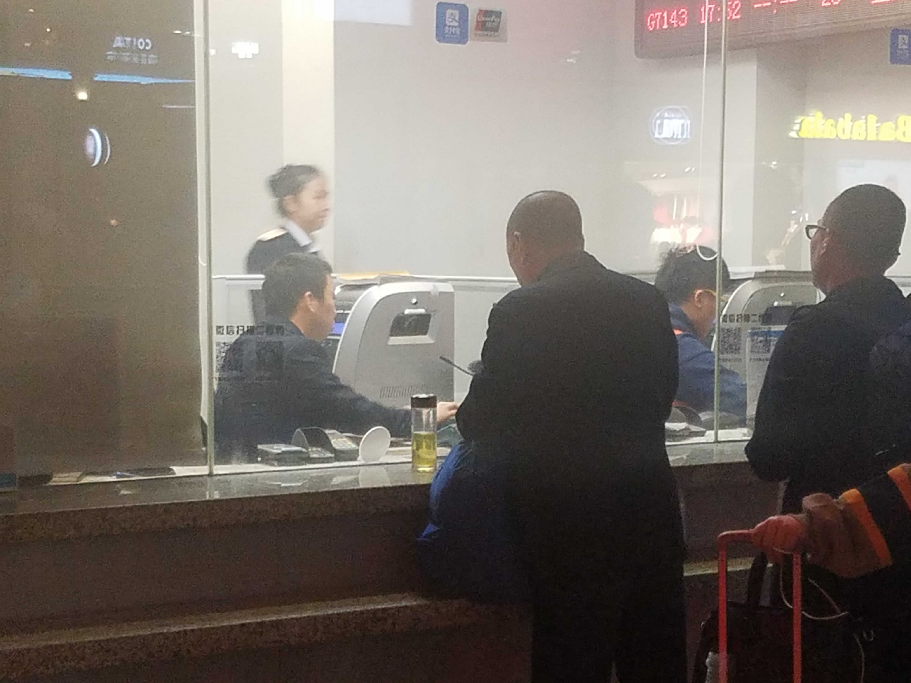</td>
  </tr></table>
   
  
  Unlike the metro, ticket machines for trains are of no use for you, because you would need Chinese ID-card in order to buy anything with them. You have to queue on the usually longer queue and buy a ticket for Suzhou Railway station.
  You need to show the [note(please print out)](photo/buy-ticket1.pdf), your passport and money to the ticket officer to get a ticket. 
  The ticket will cost around 39.5 RMB and looks like this:
    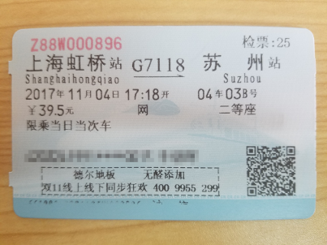  
  The G-Number (G7118 above) stands for the train number, which identifies the train also on the large displays at the hall. Below that number is the date and departure time, in this case 2017-11-04 and departure time 17:18. To the right is the coach number (04) and seat number (03B). Just below from that is the sign that the ticket is for second class (二). For the short duration of the trip there is no real need to buy a ticket for first class. On the top right-hand corner is the platform written(25).
  
   
  
  Next you have to wait for your train on the main concourse of the station. Once you know the platform, go to the gate. Be careful, the gates are nestled between shops and can be easily overlooked. For each platform there are two gates labelled "A" and "B", respectively. They are on opposite sides of the main hall. "A" stands for the front of the train and "B" for the rear -- you know which one to go to from the coach number on your ticket. The gate of 25A is like this:
  
    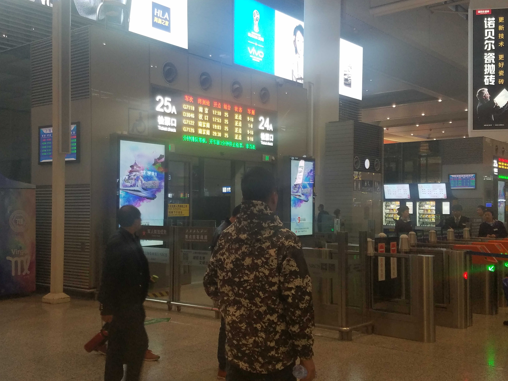  
  
  When the gates are opend for your train, which means the train number (in this example G7118) turn to green on the board (see below picture), you need to show again your passport verifying that it is you who is travelling on the ticket.
  
    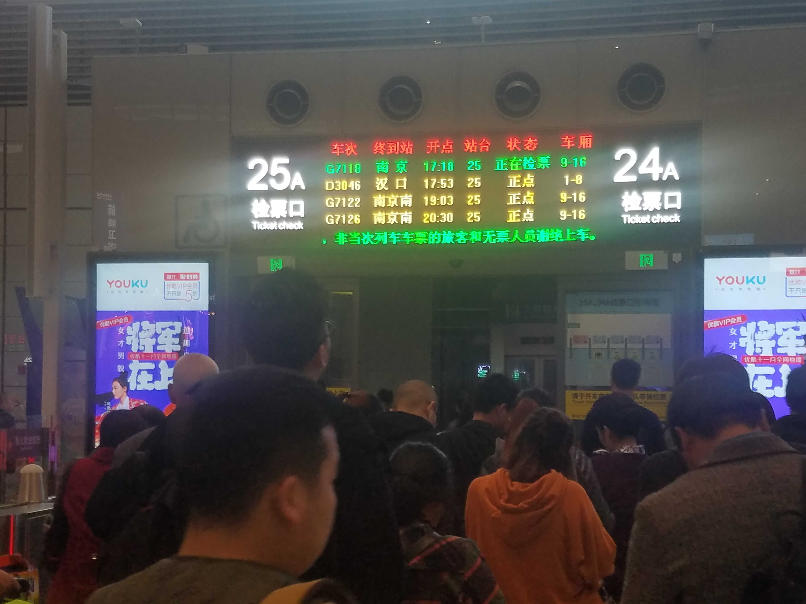  
  
  Following the crowd, you will see the train. Getting on the coach with the coach number in your ticket (04 in this example), then you need to find you seat. Seat number is shown above the window as below.
  
   
  <table><tr>
  <td>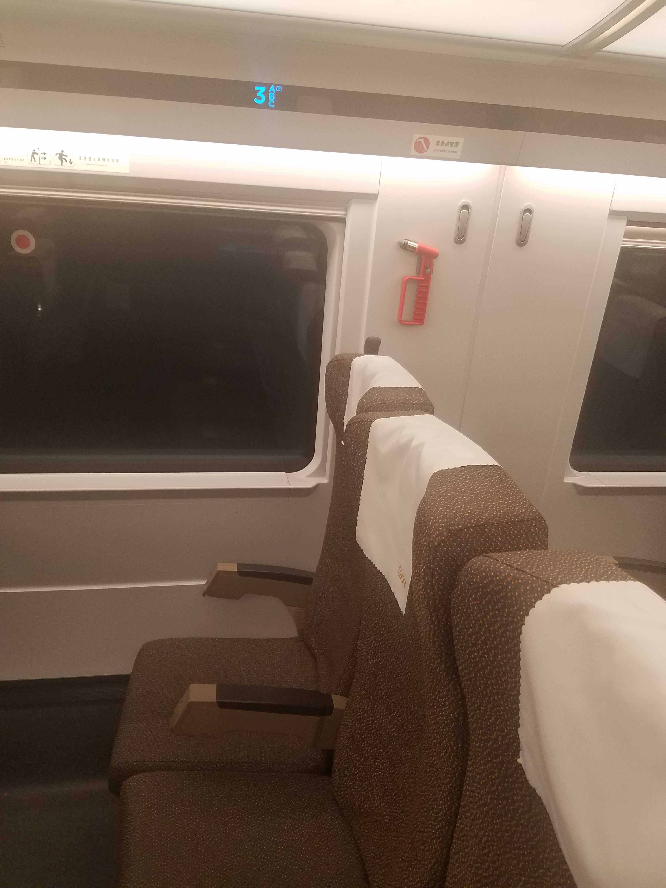</td>
  <td>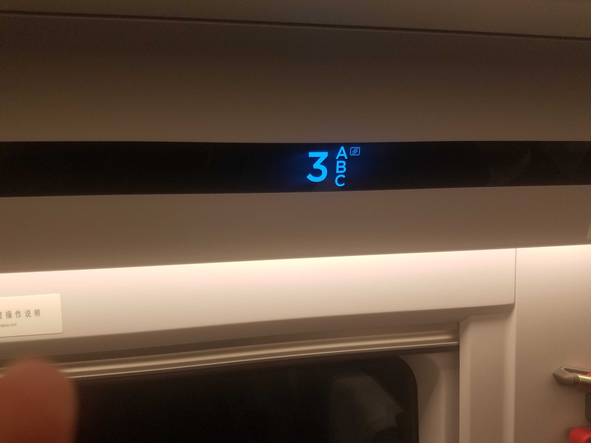</td>
  </tr></table>
   
  
  The "3" is the seat number and "A" denotes the seat beside the window, "C" the seat beside the passage. In this example, according to the seat number 03B, you may sit on the seat denoting by "B", which is the middle seat. 
  
  The journey to Suzhou Railway Station takes around 30m. Make sure your arrival station announced by the train is exactly "Suzhou Railway Station", not "Suzhou North Railway Station" or other. Trains from Hongqiao to Suzhou work from 6:09-21:42 at nearly 30m intervals. 

 

### Suzhou Railway Station to the Conference Center
After checking your ticket to exit the train station, you will find a sign for "Taxi(North)" as shown below:
  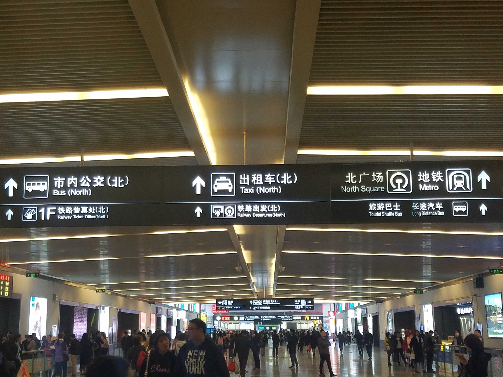  
Following signs and you will see a KFC(Kentucky Fried Chicken) on your right hand side. Beside the KFC, there is the taxi stand(the left picture as below). When you enter it, you will see many taxies waiting on the road(the right picture).

   
  <table><tr>
  <td>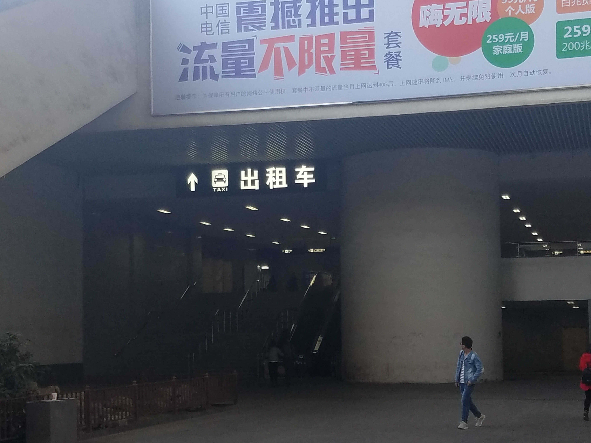</td>
  <td>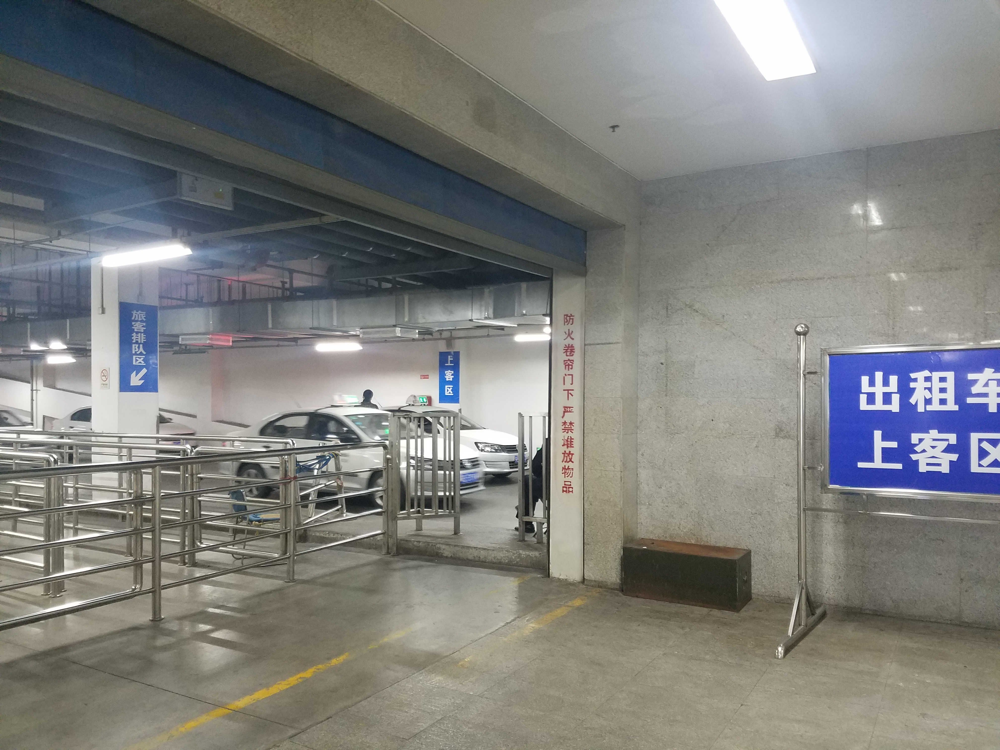</td>
  </tr></table>
   
  
  Get on an empty taxi, and then show the [map togeher with notes](photo/map1.pdf)(please print it out) for the driver, he will drive you to the conference center. Don't forget to take the receipt when you arrive. 
  If you need to go to the hotel instead of the conference center, then below table is useful for you:
  
  <table class="abc">
  <tr class="abc">
  <th class="abc"> Hotel </th> <th class="abc"> Map </th> <th class="abc"> Cost </th>
  </tr>
  <tr class="abc">
  <td class="abc"> Jinling Guanyuan International Hotel </td> <td class="abc"> <a href="photo/map2.pdf"> link </a> </td> <td class="abc"> 60RMB </td>
  </tr>
  <tr class="abc">
  <td class="abc"> Jingzhai Hotel </td> <td class="abc"> <a href="photo/map3.pdf"> link </a> </td> <td class="abc"> 60RMB </td>
  </tr>
  </table>
  

  The journey will cost you around 60 RMB and takes about 45 minutes. The taxi needs to be paid in cash. Make sure the taxi driver switches on the meter once you left the taxi stand!

 

## Travel from Pudong International Airport to the Conference Center

There are two options to travel from this airport to the conference center:

* The first option is to take a long distance bus to Suzhou Railway Station directly. We recommend this option. 

* A bit more complex is going first by metro Line 2 to Hongqiao Railway Station, which is the last but one station of the line. If you don't know how to buy a ticket of metro, please read [this chapter](#metro) first. The metro will operate between 6:00 and 22:00. At Guanglan Road station however, you need change to the train at the opposite side, for the metro line from Pudong International Airport to Hongqiao Railway Station is split to two disjoint part. The Guanglan Road is the split point. There is detailed explanation in English from the broadcast, so don't worry too much. To complicate more, the metro may end at Songhong Road, for the shorter line can enhance the throughput of the metro. On this situation, you must wait for the next metro train at the same side. The metro will cost you 8 RMB and take about 2 hours. After you arrive at Hongqiao Railway Station, remain part of the journey is same as from Hongqiao airport and you can refer to [that chapter](#train).

### From Pudong International Airport to the Conference Center
Following the signs for "Long Distance Bus", you can find the bus stop, which may take you 10min by walk. The signs are shown as below:

   
  <table><tr>
  <td>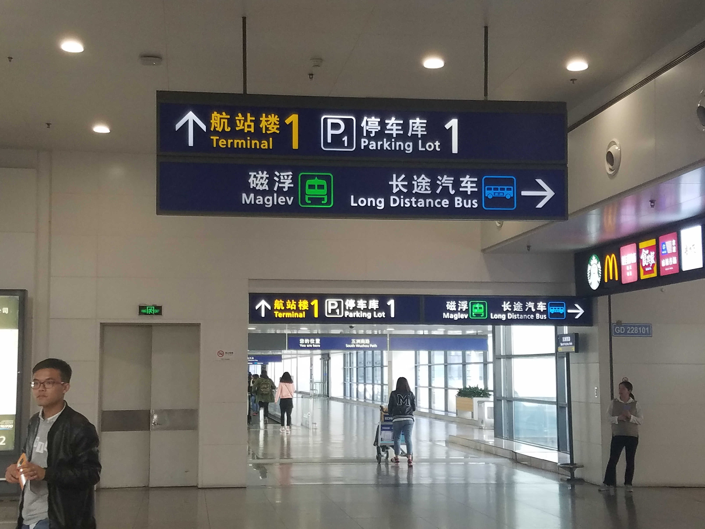</td>
  <td>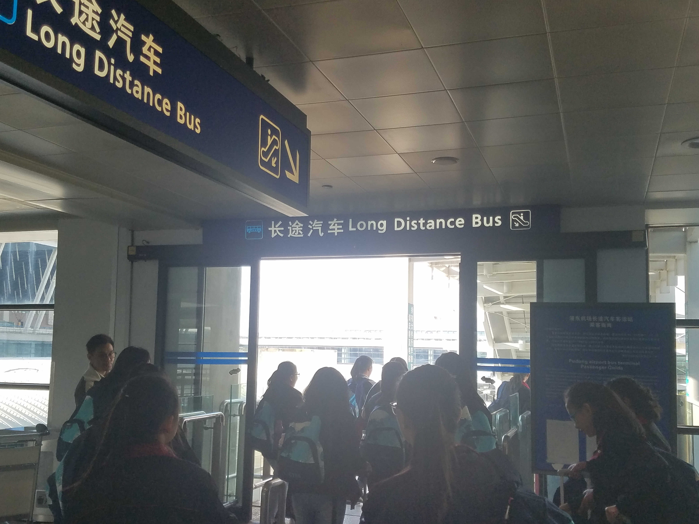</td>
  </tr></table>
   
  
  Next you need to buy a bus ticket. There are ticket counters, see below.
  
    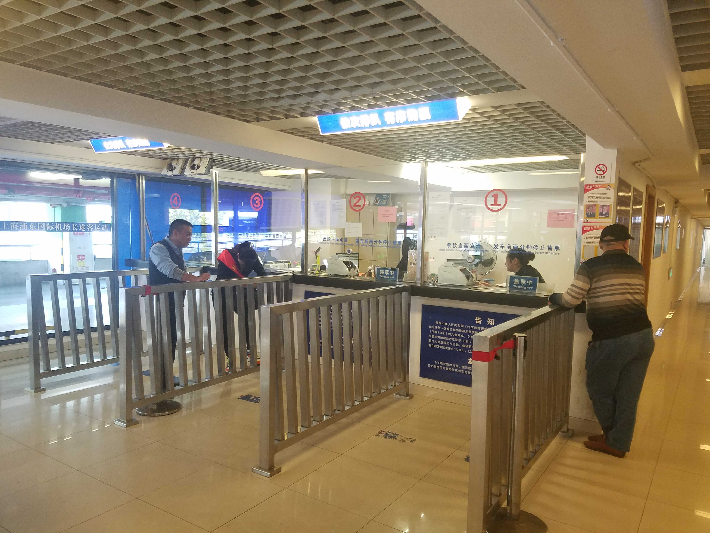  
  
  You need to show the [note(please print out)](photo/buy-ticket2.pdf), your passport and money to the ticket officer to get a ticket.
  The ticket will cost around 84 RMB and looks like this:
  
    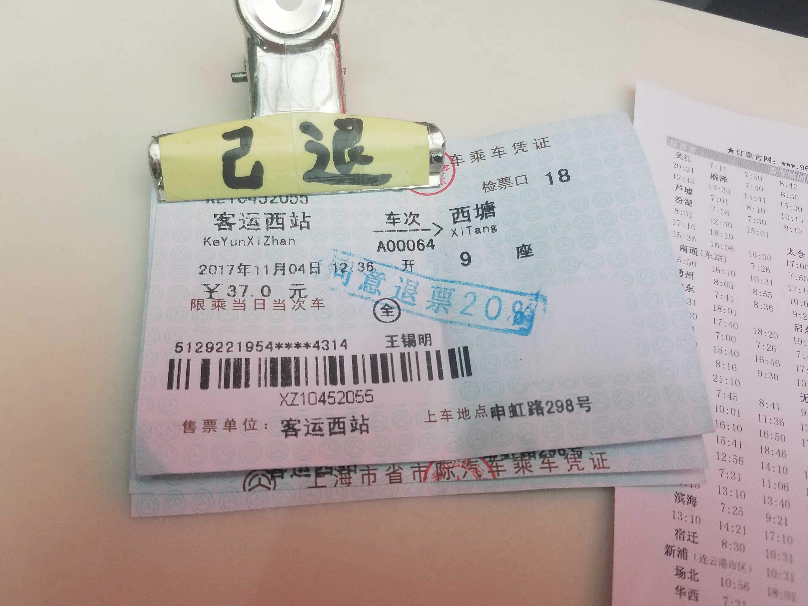  
  
  This is not a ticket from Pudong to Suzhou, but the layout of tickets is the same. The number(A00064 above) below the arrow stands for the bus number. Right below the number is your seat number(9) and the number on the right up corner(18) is the platform number, denoting where to wait for the bus. After buying the ticket, you can get into the waiting room through a security gate (as below), and wait for your bus according to the platform number on the ticket.
  
    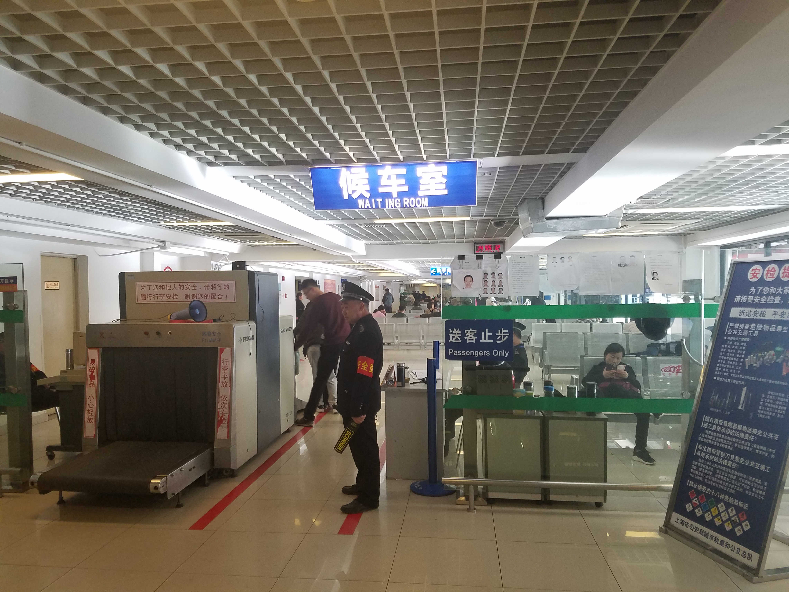  
  
  The bus takes around 3h and make only two stops at the very end of the journey. Both stops are in Suzhou and you have to take the second stop at Suzhou Railway Station. This bus works from 9:20 to 21:00, and the detailed departure times are: 9:20, 10:10, 10:40, 11:10, 11:40, 12:10, 12:45, 13:30, 14:15, 14:50, 15:30, 16:10, 16:50, 17:30, 18:10, 18:50, 19:40, 20:30, 21:00.
  When you get off the bus, you need to walk out the bus station and will see a big square. Then walking into the square, you may find some sign (as below) directing you to the B1 floor.
  
   
  <table><tr>
  <td>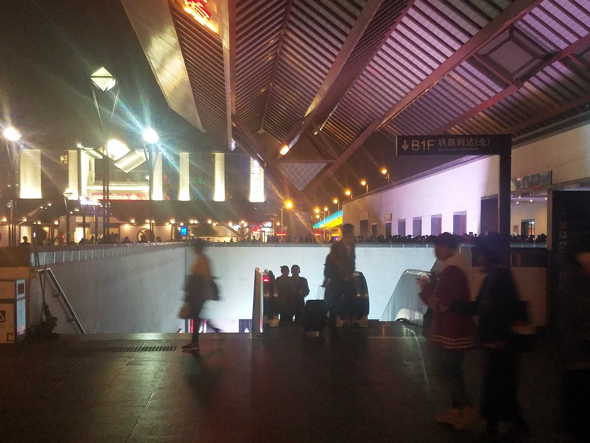</td>
  <td>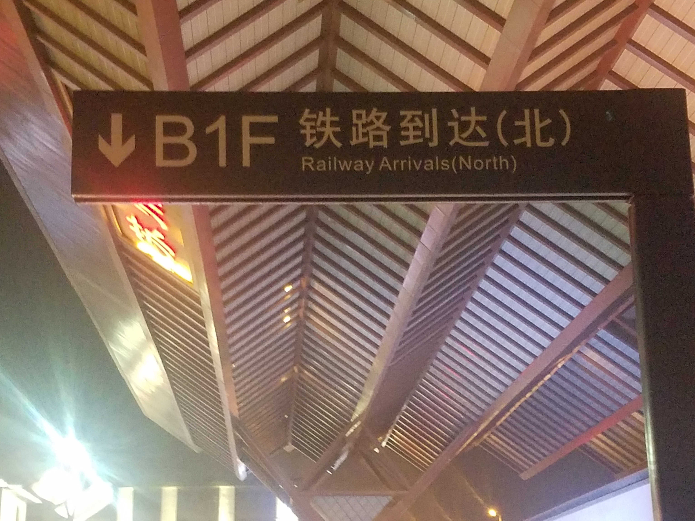</td>
  </tr></table>
   
  
  The B1 floor is the place same as you arrive at the station by train. So following the signs for "Taxi(North)", you will find the same taxi stand described in the previous chapter. According to the information in [that chapter](#taxi) , you will be driven to the conference center. 
